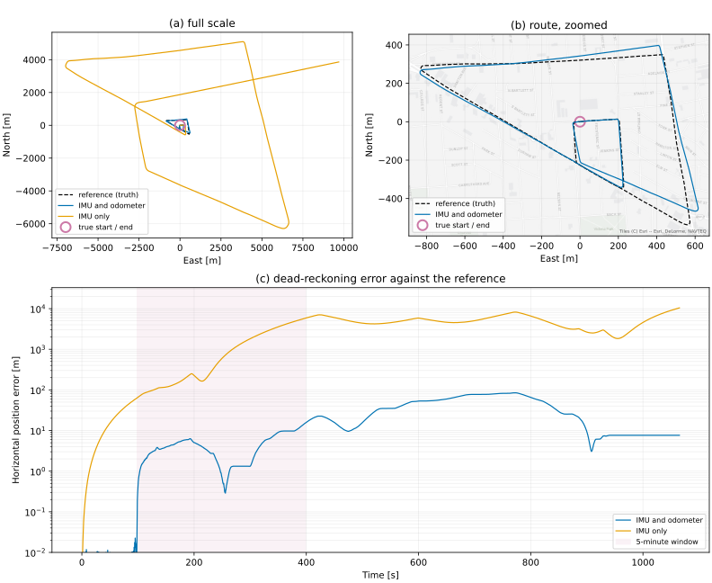
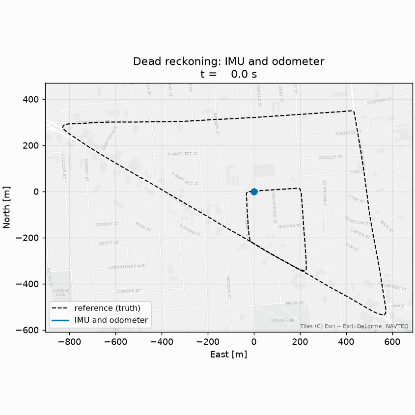

# Robust vehicle localization through GNSS outages<br><sup>*EKF vs UKF Fusion of IMU, GNSS and Wheel Odometry*</sup>

Ground vehicles such as cars, automated guided vehicles (AGVs) and mobile robots
depend on the Global Navigation Satellite System (GNSS) to know where they are.
On open roads, a consumer receiver can hold position to within a metre or two, continuously. How well it does that depends entirely on the surroundings, and can change abruptly. Once you find yourself between tall buildings, under a bridge, or driving into a garage, satellites are blocked, signals arrive after bouncing off facades for instance, and the receiver can report a position that is wrong, or worse, it stops reporting at all. Of the three routes used here, two have no GNSS outage at all. In the third, GNSS is missing for 98% of the run.

When GNSS goes, what is left is an inertial measurement unit (IMU) and a wheel odometer, with which we can still estimate our position through a process called *dead reckoning*. However, dead reckoning relies on the IMU's and odometer's measurements, whose errors compound quickly.

The question this project asks is how far and how long a vehicle can hold an
accurate position once GNSS degrades or drops out, and whether the filter's own
uncertainty stays honest while it does. The approach is sensor fusion through an
extended and an unscented Kalman filter combining the IMU, the wheel odometer
and GNSS when it is there.

## Status

In progress. The dead-reckoning baseline is measured; the EKF and UKF are
being built.

## Dataset: NavINST 

For this project we make use of the NavINST dataset[^1].

## Results

Only the dead-reckoning baseline has been measured so far. The EKF and UKF are
still being built.

### How bad is dead reckoning on its own?

The run below is `Urban04`, a $4.87\,km$ loop through Kingston, Ontario. Both
versions integrate the gyroscope for heading and differ only in where forward
speed comes from: the wheel odometer, or the accelerometer.



As you can see, especially in the zoomed panel, the estimate drifts away from the
truth and never finds its way back. Over five minutes of driving, the horizontal
position error, which is the usual way to report positioning accuracy, comes to
$5.67 \,m$ RMSE with the odometer and $2250\,m$ without it.

The specific 5-minute window was chosen because dead-reckoning error grows without bound and
the number depends entirely on how long a period you calculate it over. The same odometer run
gives $35.8\,m$ over the full 17.75 minutes. We chose five minutes, because a GNSS outage tends to last seconds to a minute rather than a quarter of an hour.



The IMU-only run is there to make the odometer's contribution visible. In
practice you would not use an accelerometer to get speed, because that means
integrating twice, so even a small measurement error grows quadratically.

One piece of preprocessing matters. The gyroscope reports a small rotation even
when the vehicle is standing still, and left alone that bias becomes a steadily
growing heading error. Every NavINST trajectory starts with about two minutes
parked, so the bias can be measured from the data rather than assumed, and
subtracted before integrating.

The error plot also shows that the error does not grow steadily. It rises, falls
back, and rises again. From the 2D plots we can see that the route is a loop with many
turns, so a heading error that pushes the estimate to one side on one leg pushes
it back on the return leg.

So without GNSS, dead reckoning is not enough to accurately keep track of where the vehicle
is. The next step is to see how much Kalman filtering helps.

## How to reproduce

Every figure and number above comes from two commands. Python 3.11 or newer.

**1. Set up the environment**

```bash
git clone https://github.com/xyzhang8/imu-gnss-localization.git
cd imu-gnss-localization
python -m venv .venv && source .venv/bin/activate
pip install -r requirements.txt
```

**2. Download the data**

The bags are not in this repository. Download them from the NavINST record on
FRDR, [doi:10.20383/103.01089](https://doi.org/10.20383/103.01089), and put them
in `data/raw/`. Only three of the six bags per route are needed; the
camera, lidar and radar bags are the bulk of the 465 GB and are never read.

For `Urban04` that is `gnss.bag` (59 MB), `imus.bag` (335 MB) and
`reference.bag` (9.9 MB), laid out as the archive ships them:

```
data/raw/Urban04/2023-11-01-12-16-16-Day/{gnss,imus,reference}.bag
```

**3. Decode and run**

```bash
python src/data_loader.py --sequence Urban04
python scripts/make_e1_figure.py
```

The first turns 404 MB of bags into about 12 MB of Parquet in a few seconds. The
second writes `results/e1_dead_reckoning.svg`, the two animations and
`results/metrics.csv`, and prints the headline numbers. Add `--no-animations` to
skip the GIFs, which take about a minute.

The street map under the zoomed panel is already cached in `results/`, so nothing
here needs a network connection. `scripts/fetch_basemap.py` regenerates it and is
the only part that does; it needs the optional `contextily` dependency.

## Citation and License

The NavINST dataset is released under
[CC BY 4.0](https://creativecommons.org/licenses/by/4.0/). All measurements and
ground truth used here, and every figure derived from them, come from it. The
data has its own DOI, separate from the paper[^1]:
[doi:10.20383/103.01089](https://doi.org/10.20383/103.01089).

The street map under the zoomed trajectory panel and the animation is
`Esri.WorldGrayCanvas`: Tiles (C) Esri, with data from Esri, DeLorme and NAVTEQ.

[^1]: Araujo, P., Mounier, E., Bader, Q., Dawson, E., Kaoud Abdelaziz, S., Zekry, A., Elhabiby, M., & Noureldin, A. (2025). The NavINST Dataset for Multi-Sensor Autonomous Navigation. *IEEE Access*. https://doi.org/10.1109/ACCESS.2025.3565878
